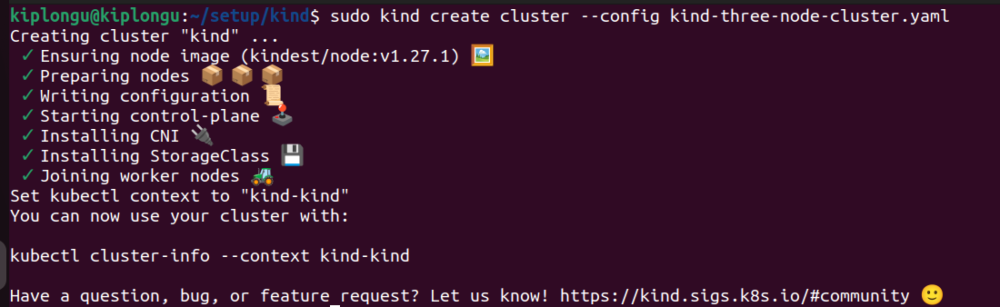

Lab 3. Setting Up Your Lab Environment

Create a Google Cloud Account

Google Cloud offers a Free Trial Account which you can sign up for here:
https://cloud.google.com/free. As of May 2023, Google offers $300 worth of credits valid for 90
days.

Install Git

Refer to the Git Installation documentation to find the instructions to install Git for your operating
system. To install Git on Ubuntu 22.04 LTS, use the following command:

sudo apt install git

Install Docker

To install Docker on Mac and Windows, download Docker Desktop and install it using the
graphical installer.
To install Docker on Linux, follow the official instructions for your Linux distribution available in
the Docker documentation.
To install Docker on Ubuntu 22.04 LTS, follow the sequence of instructions below:

#!/bin/bash
apt-get update
apt-get install -yq git wget
# Install Docker
apt-get install -yq \
apt-transport-https \
ca-certificates \
curl \
software-properties-common
curl -fsSL https://download.docker.com/linux/ubuntu/gpg | sudo apt-key
add -
apt-key fingerprint 0EBFCD88
add-apt-repository \
"deb [arch=amd64] https://download.docker.com/linux/ubuntu \
$(lsb_release -cs) \
stable"
install -m 0755 -d /etc/apt/keyrings
chmod a+r /etc/apt/keyrings/docker.gpg
apt-get update
apt-get install -yq docker-ce
curl -L "https://github.com/docker/compose/releases/download/`curl
-fsSLI -o /dev/null -w %{url_effective}
https://github.com/docker/compose/releases/latest | sed 's#.*tag/##g'
&& echo`/docker-compose-$(uname -s)-$(uname -m)" -o
/usr/local/bin/docker-compose
chmod +x /usr/local/bin/docker-compose
ln -s /usr/local/bin/docker-compose /usr/bin/docker-compose

Install Kubectl

Follow the official Kubernetes documentation to install kubectl for your operating system.
To install the latest version of kubectl on Ubuntu, use the following sequence:

curl -LO "https://dl.k8s.io/release/$(curl -L -s
https://dl.k8s.io/release/stable.txt)/bin/linux/amd64/kubectl"
chmod +x kubectl
mv kubectl /usr/local/bin/
kubectl

Install Kustomize

To install the Kustomize binary using curl, use the following command:

curl -s "https://raw.githubusercontent.com/\
kubernetes-sigs/kustomize/master/hack/install_kustomize.sh"
| bash
mv kustomize /usr/local/bin/
kustomize

Alternately, refer to Kustomize | SIG CLI to find the various options and detailed instructions to
install kustomize.

 Install Kind

To install kind for your operating system, use the official installation documentation and follow
the instructions provided.
On Linux,

curl -Lo ./kind https://kind.sigs.k8s.io/dl/v0.19.0/kind-linux-amd64
chmod +x ./kind
sudo mv ./kind /usr/local/bin/kind
kind

Set Up the Kubernetes Cluster with Kind

Download the cluster configurations from GitHub and create a three-node Kubernetes cluster
with kind:
git clone https://github.com/lfs269/setup.git
cd setup/kind/
kind create cluster --config kind-three-node-cluster.yaml
Validate:
kind get clusters
kubectl cluster-info --context kind-kind
kubectl get nodes

Important commands

List Available Contexts:
kubectl config get-contexts

Manually Set Kind Context:
kubectl config set-context kind-kind --cluster=kind --user=kind

Switch to Context:
kubectl config use-context kind-kind
kubectl config use-context dev-uamuzi-aks

