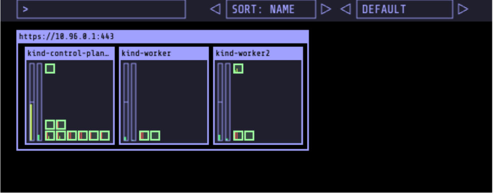

Set Up the Visualiser

cd ~
git clone https://github.com/schoolofdevops/kube-ops-view
kubectl apply -f kube-ops-view/deploy/
kubectl get pods,svc

Once the pod for kube-ops-view (Visualiser) comes up, to access the Visualiser, browse to
http://IPADDRESS:32000. You would replace localhost with the actual IP of your server if it’s
a remote host.
You are expected to see a visualiser page such as the one below:

Note: Visualiser is a non-essential tool; you can also proceed without it as well. At times, it
shows up as blank on the web page, in which case, you could proceed with the next
chapters/labs.