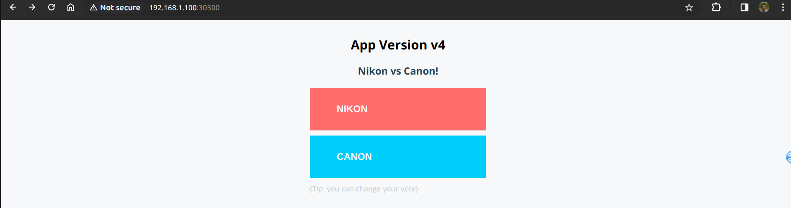
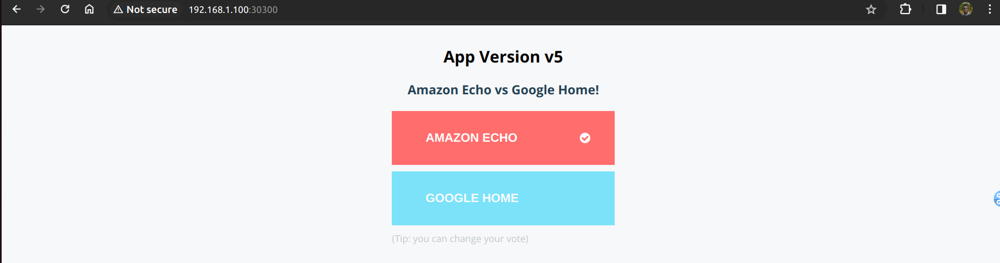
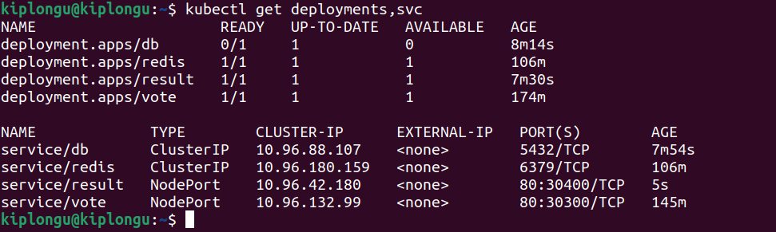
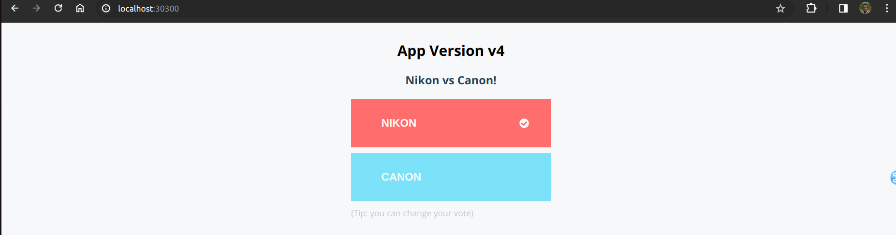
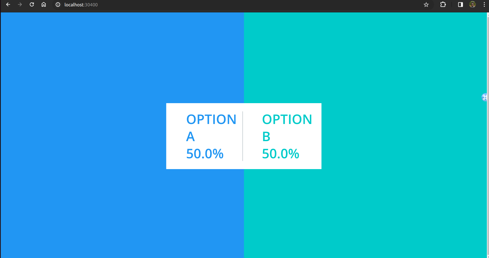

Lab 4. Deploying a Microservices App with Kubernetes

Overview

In this lab, you are going to deploy the instavote application stack as described here in a
Kubernetes environment using kubectl commands. Later, you would learn how to do the same
by writing declarative yaml syntax.
The purpose of this lab is to quickly get your app up and running and demonstrate key
Kubernetes features such as scheduling, high availability, scalability, load balancing, service
discovery, etc.

Deploying the instavote App with Kubernetes

Before launching the app, create a new namespace and switch to it:

kubectl get ns
kubectl create namespace instavote
kubectl get ns
kubectl config get-contexts
kubectl config set-context --current --namespace=instavote
kubectl config get-contexts

Launch the vote application with Kubernetes in the newly created namespace.

kubectl create deployment vote --image=schoolofdevops/vote:v4

You could now validate that the instance of the vote app is running by using the following
commands:

kubectl get pods
kubectl get deploy
kubectl get all

Feature - Scalability

Scale the vote app to run four instances:

kubectl scale deployment vote --replicas=4

kubectl get deployments,pods

Feature - High Availability
kubectl get pods

The above command will list the available pods. Try to delete a few pods and observe how it
affects the availability of your application.

kubectl delete pods vote-xxxx vote-yyyy
kubectl get deploy,rs,pods

Feature - Load Balancing with Services

Publish the application (similar to using -P for port mapping):

kubectl create service nodeport vote --tcp=80 --node-port=30300
kubectl get service

Connect to the app using http://IPADDRESS:30300 (replace IPADDRESS with your actual
IP address), then refresh the page to see it load balancing. Also, try to vote and observe what
happens.

Feature - Zero Downtime Deployment

kubectl scale deployment vote --replicas=12
kubectl set image deployment vote vote=schoolofdevops/vote:v5

Watch the rolling update in action:
kubectl rollout status deploy/vote

Feature - Internal Service Discovery

Even though you see the frontend vote app running, if you try to vote using the UI, it does not
go through. In order for it to work, you need to deploy the redis deployment, along with the
service with the following spec:

Run the following commands to deploy redis:

kubectl create deployment redis --image=redis:alpine
kubectl create service clusterip redis --tcp=6379

And validate with:

kubectl get deploy,svc

You should see a service and deployment both created for redis. And now, if you browse to
the frontend and submit a vote, it should go through.

Automating the YAML Manifest Creation

You have already learned how to create deployments and services using kubectl create
commands. However, most of the objects that you manage with Kubernetes would be used by
defining them with YAML specs. Understanding how to write a YAML spec is crucial for
Kubernetes mastery. However, here is a shortcut to generate the YAML code:
In order to do so, you must know the following two options with the kubectl command:

--dry-run=client option, which would not create/apply, but only do a client-side dry
run.
-o yaml option, which would output the resource spec in YAML format.

For example, to create a YAML spec for the deployment, you could invoke a command that you
used earlier, but this time using the options above:

kubectl create deployment vote \
--image=schoolofdevops/vote:v4 \
--dry-run=client \
-o yaml

You could now take the output of the command above and redirect to a YAML file:

kubectl create deployment vote \
--image=schoolofdevops/vote:v4 \
--dry-run=client \
-o yaml > vote-deployment.yaml

You could now validate the content of the file above and try to apply it:
cat vote-deployment.yaml
kubectl apply -f vote-deployment.yaml

Similarly, you could generate the code for the vote service as:

kubectl create service nodeport vote \
--tcp=80:80 \
--node-port=30300 \
--dry-run=client \
-o yaml > vote-service.yaml

Validate and apply:

cat vote-service.yaml
kubectl apply -f vote-service.yaml

Nano Project: Deploy a Complete Instavote App
Deploy the services with the following spec to complete this application stack:

If you see the db deployment failing, fix it by adding the environment variable as:

kubectl set env deployment db POSTGRES_HOST_AUTH_METHOD=trust

After deploying all services, to validate:

Browse to vote and result services exposed outside to see the UI
When you submit a vote, it should be reflected on result
To submit multiple votes, use either a different browser, or use an incognito window.

Cleaning Up

Once you are done observing, you could delete it with the following commands:

kubectl delete deploy vote redis worker db result
kubectl delete service vote redis db result

Summary
When you deploy an application in Kubernetes, you submit it to the API server/cluster manager.
Kubernetes automatically schedules it on a cluster, networks the pods, and provides service
discovery. In addition, as you observed, your application is scalable, highly available and is
already running behind a load balancer.