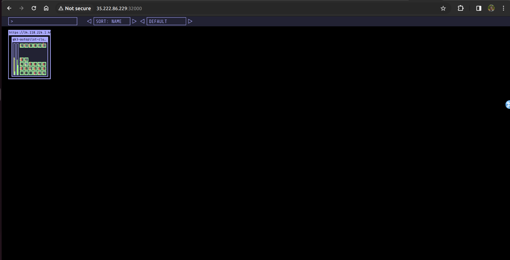

Set Up the Kubernetes Staging Cluster on GKE

Set up a Google Cloud account by browsing to https://cloud.google.com/free.
Once your account is set up, login and browse to the cloud console by visiting
https://console.cloud.google.com/
From Navigation select Compute → Kubernetes Engine (GKE) → Clusters

This will open a new cluster creation wizard as follows. Select LETS GET STARTED to proceed.
From the next page, select the default options without changing anything and proceed to create
Cluster using Auto Pilot Configurations:

Set Up Firewall Rules to Allow Access to Applications
From Networking → VPC Network select Firewall.

From the available firewall rules, select the one which matches gke-autopilot-cluster-xxx-all.
Look for the word all and click on that option.
Click on Edit when presented with Firewall rule details.
From the Action on Match section:
1. Add the Source IP Rage as 0.0.0.0/0.
2. Select Allow All from Protocols and ports.
3. Click on Save.

This will allow the services that you expose with NodePort to be accessed from outside the
cluster.

Set Up the Visualizer

The Visualiser is a third party open source application which helps you visualize not only your
cluster nodes, but also the application workloads running as workloads on top of this cluster.
Once you are done setting up the cluster using the instructions above, open a cloud shell and type in the following commands:

git clone https://github.com/schoolofdevops/kube-ops-view
kubectl apply -f kube-ops-view/deploy/

You could access the visualizer by discovering the External IP address of any of the nodes and
by browsing to http://NODEIP:32000.

To find the NodeIP (External IP) run the following command in the Cloud Shell:
kubectl get nodes -o wide
where External-IP will show you the IP that you can use to connect to the cluster nodes over
NodePort such as above (e.g. 32000).

