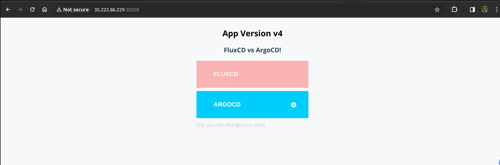

Lab 7B. Kustomizing Kubernetes Deployments

In this lab, you are going to learn the following:

How to create custom configuration profiles with Kustomize
How to generate the overlay file structure used by Kustomize
How to write kustomization.yaml with its key primitives
How to provide additional Kustomization configurations such as images, replicas,
generators, etc.
To continuously monitor for the deployments with the Flux Kustomization Controller, open a new
terminal and run the following command:

watch flux get kustomizations

In case of issues, you could also watch the logs using the following command:

flux logs -f --tail 10

Install the Kustomize Tool

To install the Kustomize binary using curl, use the following command:
curl -s "https://raw.githubusercontent.com/\
kubernetes-sigs/kustomize/master/hack/install_kustomize.sh"
| bash
mv kustomize /usr/local/bin/
kustomize
Alternately, refer to Kustomize | SIG CLI to find the various options and detailed instructions to
install kustomize.

Restructure the Deployment Code for Kustomize

You have already created basic Kubernetes deployment manifests. Begin by restructuring these
configurations so that you could provide multiple overlays.
From the application repository which hosts your deployment code, run the following to create
the base + overlay structure:
cd instavote/deploy/vote
mkdir base
git mv deployment.yaml
service.yaml base/
cd base
kustomize create --autodetect
cd ..

Create Custom Configurations for Dev

Now, add the overlay files (custom configuration) for dev.
From inside the deploy/vote path:
mkdir dev
cd dev
file: deploy/vote/dev/deployment.yaml
apiVersion: apps/v1
kind: Deployment
metadata:
creationTimestamp: null
labels:
app: vote
name: vote
spec:
minReadySeconds: 20
replicas: 3
template:
spec:
containers:
- image: schoolofdevops/vote:v4
name: vote

file: deploy/vote/dev/kustomization.yaml
apiVersion: kustomize.config.k8s.io/v1beta1
kind: Kustomization
resources:
- ../base
patchesStrategicMerge:
- deployment.yaml
Commit these changes to the application deployment repo (instavote).
From /instavote/deploy/vote:
git add *
git status
git commit -am “refactored code with kustomize overlays”
git push origin main
It’s now time to update the path to the kustomization configuration in the flux-infra
repository. Update the path as:

file: ./flux-infra/cluster/dev/vote-dev-kustomization.yaml
spec:
path: ./deploy/vote/dev
Commit all the changes and push:
git commit -am "updated the path to find manifests"
git push origin main
Keep watching for the reconciliation to the dev environment:

watch flux get kustomizations --context=dev

# Deploy to Staging

Now that the overlay structure is in place, it’s time to create another configuration profile. This
time you would be deploying to staging.
Begin by creating a namespace where you would deploy the staging infrastructure.

kubectl create namespace instavote

In the application repository (instavote) which hosts the deployment code, now create a new
overlay directory named staging:

mkdir staging

And add the kustomization overlays:
file: deploy/vote/staging/deployment.yaml
apiVersion: apps/v1
kind: Deployment
metadata:
creationTimestamp: null
labels:
app: vote
name: vote
spec:
replicas: 5
template:
spec:
containers:
- image: schoolofdevops/vote:v3
name: vote

file: deploy/vote/staging/service.yaml
apiVersion: v1
kind: Service
metadata:
creationTimestamp: null
labels:
app: vote
name: vote
spec:
ports:
- name: "80"
port: 80
targetPort: 80
nodePort: 30200
protocol: TCP

file: deploy/vote/staging/kustomization.yaml
apiVersion: kustomize.config.k8s.io/v1beta1
kind: Kustomization
resources:
- ../base
patchesStrategicMerge:
- deployment.yaml
- service.yaml
namespace: instavote
Commit these changes to the instavote repo:
cd instavote/deploy/vote
git add *
git status
[Sample Output]
Changes to be committed:
(use "git restore --staged <file>..." to unstage)
new file:
staging/deployment.yaml
new file:
staging/kustomization.yaml
new file:
staging/service.yaml
git commit -am "added kustomization overlay for staging"
git push origin main

Now, add the kustomization spec for staging to the flux-infra repo:
file: ./flux-infra/cluster/staging/vote-staging-kustomization.yaml
---
apiVersion: kustomize.toolkit.fluxcd.io/v1beta1
kind: Kustomization
metadata:
name: vote-staging
namespace: flux-system
spec:
healthChecks:
- kind: Deployment
name: vote
namespace: instavote
interval: 1m0s
path: ./deploy/vote/staging
prune: true
sourceRef:
kind: GitRepository
name: instavote
targetNamespace: instavote
timeout: 2m0s

File: `instavote-gitrepository.yaml`
---
apiVersion: source.toolkit.fluxcd.io/v1
kind: GitRepository
metadata:
name: instavote
namespace: flux-system
spec:
interval: 30s
ref:
branch: main
url: https://github.com/xxxxxx/instavote.git
git add vote-staging-kustomization.yaml instavote-gitrepository.yaml
git commit -am "add kustomization for staging infra"
git push origin main
Watch for the reconciler to pick up the configuration for staging and deploy the vote
application inside the instavote namespace.
watch kubectl get all -n instavote
If you want to run the reconciliation manually:
flux reconcile kustomization flux-system

Additional Kustomization Configs
Let's now explore a few more kustomization properties.
# Images & Replicas
You can update images and replicas, some of the frequently updated configurations.
file: deploy/vote/staging/kustomization.yaml
apiVersion: kustomize.config.k8s.io/v1beta1
kind: Kustomization
resources:
- ../base
patchesStrategicMerge:
- deployment.yaml
- service.yaml
namespace: instavote
images:
- name: schoolofdevops/vote
newTag: v4
replicas:
- name: vote
count: 4
Commit the Changes and Push
git commit -am "configure image and replicas count"
git push origin main
While running, the kustomization fails:
[Sample Error]
vote-staging
main@sha1:4dcfff4e
False
False
Deployment/instavote/vote dry-run failed, reason: Invalid, error:
Deployment.apps "vote" is invalid: spec.sel
ector: Invalid value:
v1.LabelSelector{MatchLabels:map[string]string{"app":"vote",
"env":"staging", "project":"instavote"},
MatchExpressions:[]v1.LabelSelectorRequirement(ni
l)}: field is immutable

This error is because you cannot change the selector configuration on an existing deployment
(immutable field).
In this case, to fix this error, simply delete the deployment and let Flux create it afresh with new
configurations:
kubectl get all -n instavote
kubectl delete deployment vote -n instavote
kubectl get all -n instavote
Let Flux trigger the reconciliation and this time launch the deployment with updated
configurations.

# Common Labels and Annotations
You could apply labels and annotations to all the resources by adding the following snippet to
kustomization.yaml:
commonLabels:
project: instavote
env: staging
commonAnnotations:
supported-by: "sre@example.com"

# ConfigMaps and Generator Options

Add the following snippet to kustomization.yaml to automatically generate a ConfigMap for
the vote app:
configMapGenerator:
- name: vote
literals:
- OPTION_A=STAGING
- OPTION_B=DEV
Also add the code to reference the ConfigMap, as in:
File: `instavote/deploy/vote/stagin/deployment.yaml`
apiVersion: apps/v1
kind: Deployment
metadata:
creationTimestamp: null
labels:
app: vote
name: vote
spec:
replicas: 5
template:
spec:
containers:
- image: schoolofdevops/vote:v3
name: vote
envFrom:
- configMapRef:
name: vote
optional: true
git commit -am "generate configmap from literals"
git push origin main
Watch the application redeployed with the next reconciliation run. Validate by visiting the app,
which should now show the options provided above.

Exercise: Update the literal values provided in the ConfigMap to see the application roll out a
new version for configuration update.

For example, update the literals in kustomization.yaml:

configMapGenerator:
- name: vote
literals:
- OPTION_A=FluxCD
- OPTION_B=ArgoCD
Now commit the changes, push and observe.
git commit -am "testing rollout on config update"
git push origin main

# Create the Kustomization for Redis
Now that you have deployed the vote app in staging, it’s time to create the kustomization for
redis and also deploy it in the staging environment. Begin by reorganizing the code for the
redis app.
cd instavote
cd deploy/redis
mkdir base dev staging
git mv deployment.yaml service.yaml
cd base
kustomize create --autodetect
cd ../..
mkdir dev staging
base
file: dev/kustomization.yaml
apiVersion: kustomize.config.k8s.io/v1beta1
kind: Kustomization
resources:
- ../base
file: staging/kustomization.yaml
apiVersion: kustomize.config.k8s.io/v1beta1
kind: Kustomization
resources:
- ../base
commonLabels:
project: instavote
env: staging
commonAnnotations:
supported-by: "sre@example.com"
namespace: instavote
Commit all the changes and publish:

git add *
git status
git commit -am "add kustomizations for redis"
git push origin main
Now update the existing kustomization for redis, as well as add the redis-staging
kustomization in the flux-infra repo.
file: ./flux-infra/clusters/dev/redis-kustomization.yaml
---
apiVersion: kustomize.toolkit.fluxcd.io/v1beta1
kind: Kustomization
metadata:
name: redis-dev
namespace: flux-system
spec:
healthChecks:
- kind: Deployment
name: redis
namespace: instavote
interval: 1m0s
path: ./deploy/redis/dev

prune: true
sourceRef:
kind: GitRepository
name: instavote
targetNamespace: instavote
timeout: 2m0s

file: ./flux-infra/clusters/staging/redis-staging-kustomization.yaml
---
apiVersion: kustomize.toolkit.fluxcd.io/v1beta1
kind: Kustomization
metadata:
name: redis-dev
namespace: flux-system
spec:
healthChecks:
- kind: Deployment
name: redis
namespace: instavote
interval: 1m0s
path: ./deploy/redis/staging
prune: true
sourceRef:
kind: GitRepository
name: instavote
targetNamespace: instavote
timeout: 2m0s
git add *
git commit -am "added redis
git push origin main
kustomizations for staging"
Watch for the next reconciliation run. Ensure that when you submit a vote from the frontend
vote app, it shows a tick mark instead of an error.

This validates you have vote and redis applications running and interconnected.

