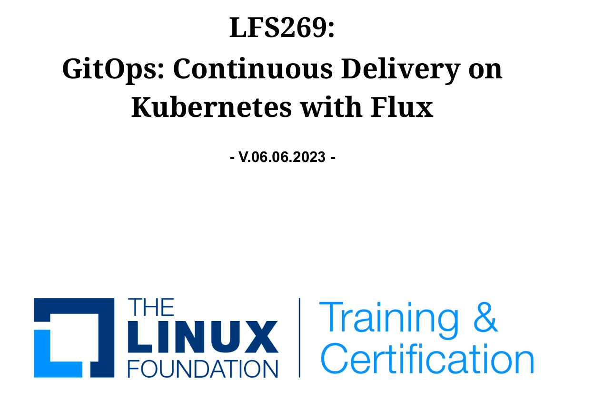

# Continuous-Delivery-on-Kubernetes-with-Flux
LFS269: GitOps: Continuous Delivery on Kubernetes with Flux

As a participant in the Linux Foundation's course "GitOps: Continuous Delivery on Kubernetes with Flux (LFS269)," I gained hands-on experience and expertise in modern DevOps practices. Throughout the labs, which covered:

Lab 3: Setting Up Your Lab Environment
Lab 4: Deploying a Microservices App with Kubernetes
Lab 5: Git Essentials for a GitOps Practitioner
Lab 6: Continuous Deployment with Flux CD
Lab 7A: Setting Up the Staging Environment
Lab 7B: Kustomizing Kubernetes Deployments
Lab 8: Deploying Helm Charts with Flux
Lab 9A: Notifying to Slack and GitHub
Lab 9B: Monitoring with Prometheus and Grafana
Lab 10: Setting Up Continuous Integration Pipelines with Tekton
Lab 11: Automating Image Updates
Lab 12A: Multi-Tenancy with Flux
Lab 12B: Flux Resources Checklist
Lab 13: Building Release Strategies with Flagger
I delved into various topics, including:

Setting up a lab environment for Kubernetes.
Deploying a microservices application using Kubernetes.
Understanding Git essentials for effective GitOps implementation.
Implementing continuous deployment with Flux CD.
Configuring staging environments and customizing Kubernetes deployments.
Deploying Helm charts seamlessly with Flux.
Leveraging Slack and GitHub for effective notifications.
Monitoring Kubernetes clusters using Prometheus and Grafana.
Setting up CI/CD pipelines with Tekton for streamlined automation.
Automating image updates for improved efficiency.
Exploring multi-tenancy solutions with Flux.
Building release strategies with Flagger for robust application deployment.
Through these hands-on labs, I honed my skills in Kubernetes, GitOps, CI/CD, monitoring, and automation, positioning myself as a proficient practitioner in modern DevOps methodologies.

